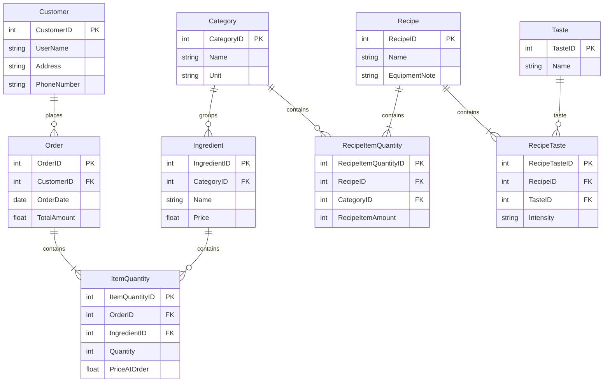

```mermaid
erDiagram
    Order{
        int OrderID PK
        int CustomerID FK
        date OrderDate
        float TotalAmount
	}
	ItemQuantity{
		int ItemQuantityID PK
		int OrderID FK
        int IngredientID FK
		int Quantity
		float PriceAtOrder
	}
	Ingredient{
		int IngredientID PK
		int CategoryID FK
		string Name
		float Price
	}
	Customer{
		int CustomerID PK
		string UserName
		string Address
		string PhoneNumber
	}
	Category{
		int CategoryID PK
		string Name
		string Unit
	}
	Recipe{
		int RecipeID PK
		string Name
		string EquipmentNote
	}
	RecipeItemQuantity{
		int RecipeItemQuantityID PK
		int RecipeID FK
		int CategoryID FK
		int RecipeItemAmount	
	}
	Taste{
		int TasteID PK
		string Name
	}
	RecipeTaste{
		int RecipeTasteID PK
		int RecipeID FK
		int TasteID FK
		string Intensity
	}	
	Order ||--|{ ItemQuantity : "contains"
	Ingredient ||--o{ ItemQuantity : "contains"
	Customer ||--o{ Order : "places"
	Category ||--o{ Ingredient : "groups"
	Recipe ||--|{ RecipeItemQuantity : "contains"
	Category ||--o{ RecipeItemQuantity : "contains"
	Recipe ||--|{ RecipeTaste : "contains"
	Taste ||--o{ RecipeTaste : "taste"
```
