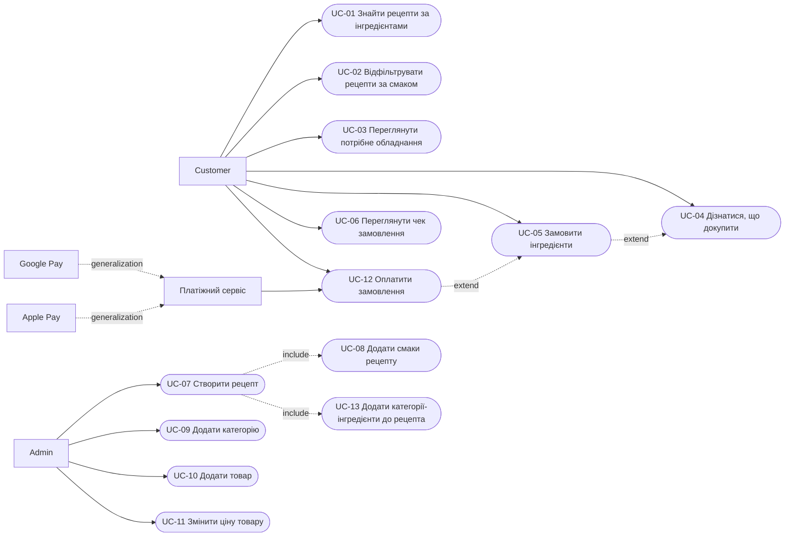

# Use Case діаграма

```mermaid
flowchart LR
  Customer["Customer"]
  Admin["Admin"]
  PS["Платіжний сервіс"]
  GP["Google Pay"]
  AP["Apple Pay"]

  UC01(["UC-01 Знайти рецепти за інгредієнтами"])
  UC02(["UC-02 Відфільтрувати рецепти за смаком"])
  UC03(["UC-03 Переглянути потрібне обладнання"])
  UC04(["UC-04 Дізнатися, що докупити"])
  UC05(["UC-05 Замовити інгредієнти"])
  UC06(["UC-06 Переглянути чек замовлення"])
  UC07(["UC-07 Створити рецепт"])
  UC08(["UC-08 Додати смаки рецепту"])
  UC09(["UC-09 Додати категорію"])
  UC10(["UC-10 Додати товар"])
  UC11(["UC-11 Змінити ціну товару"])
  UC12(["UC-12 Оплатити замовлення"])
  UC13(["UC-13 Додати категорії-інгредієнти до рецепта"])

  Customer --> UC01
  Customer --> UC02
  Customer --> UC03
  Customer --> UC04
  Customer --> UC05
  Customer --> UC06
  Customer --> UC12
  Admin --> UC07
  Admin --> UC09
  Admin --> UC10
  Admin --> UC11
  PS --> UC12

  UC07 -. "include" .-> UC08
  UC07 -. "include" .-> UC13
  UC05 -. "extend" .-> UC04
  UC12 -. "extend" .-> UC05

  GP -. "generalization" .-> PS
  AP -. "generalization" .-> PS
```